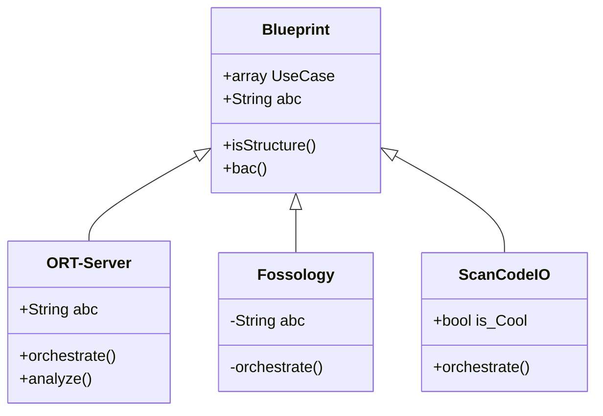

# mkurzman.github.io

This is a first trial to use github pages based on https://docs.github.com/en/pages/getting-started-with-github-pages/creating-a-github-pages-site
as preparation to test https://github.com/jgraph/drawio - integration

First test picture created with drawio:

Mermaid Test (as copied from https://mermaid.js.org/syntax/classDiagram.html) 

